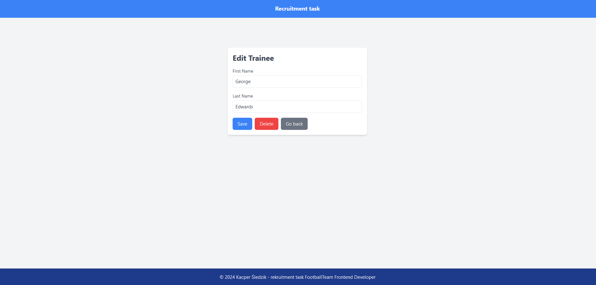

# Recruitment Task Vue

This project was created using Vue 3 and TypeScript as a recruitment task. The application displays a list of trainees with options for searching, editing, and deleting data, utilizing the fake API `reqres.in`.

## Preview

Below is a preview of the application:

### Desktop Views




### Mobile Views


## Features

- Display a list of trainees.
- Search by first and last name.
- Pagination with dynamic highlighting of the current page.
- Ability to edit and delete trainees.
- Add new trainees (navigation to a dedicated page).

## Requirements

- Node.js version 16.x or newer.
- A package manager (npm or yarn).

## Installation

1. Clone the repository to your local machine:
   ```bash
   git clone https://github.com/your-username/recruitment_task_vue.git
   cd recruitment_task_vue/frontend

2. Install project dependencies: ```npm install```
3. Start the local development server: ```npm run dev```
4. Open your browser and navigate to: ```http://localhost:5173```


## Project Structure

    src/ - Main directory containing the application code.
    components/ - Vue components used in the project.
    utils/ - Utility functions, e.g., the debounce function.
    styles/ - Global project styles.
    public/ - Static files, e.g., the favicon.

## Key Technologies

    Vue 3 - The primary frontend framework.
    TypeScript - Static typing for JavaScript.
    Axios - For handling HTTP requests.
    Tailwind CSS - Utility-first CSS framework.
    Font Awesome - For icons.